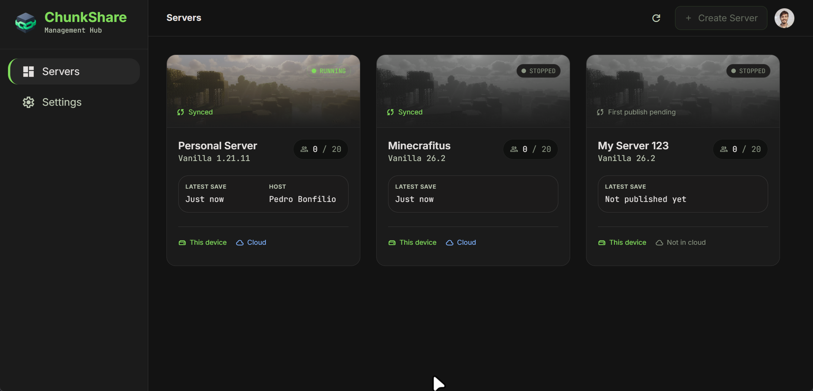

# ChunkShare

### Share a Minecraft world without leaving a server running 24/7.

Tired of asking your friend to start the server? Don't want to pay a host for your server?<br>
ChunkShare solves your problems, with it you can share the world with friends so anyone could run at a time on their own computer.



## The basic idea

Hosting a shared world usually involves a lot of trust and a few awkward manual steps: someone has to keep a machine online, send around save files, and make sure two people do not start from different versions.

ChunkShare keeps that handoff in one place:

1. Create a world or join one from a friend.
2. Set up the local Minecraft server and choose a compatible Java runtime.
3. Download the latest save and start hosting.
4. Play normally while the server is running on your computer.
5. Stop the server when you are done. ChunkShare publishes the new save and releases the world for the next host.

There is no live sync while a server is running. One person hosts at a time, and the save is handed over when that session is finished.

> **Notes:**

> - You still need Hamachi or Radmin to simulate a local network.
> - Only Vanilla Minecraft servers are supported for now.

## What it can do

- Run a local dedicated Vanilla server for a selected Minecraft version.
- Keep multiple worlds in the same local catalog.
- Store world saves locally or in Google Drive.
- Invite friends through Google Drive permissions or a share link.
- Detect a compatible Java installation automatically, or use a Java executable selected by the user.
- Track the current host with a lock, heartbeat, and session ID so an old session cannot overwrite a newer one.
- Download the latest save before hosting and publish a new save when hosting stops.
- Show server state, connection addresses, player counts, latest save information, and console output.
- Build installers for Windows, macOS, and Linux.

ChunkShare runs the Minecraft server on the host's own machine. It does not provide remote or always-on hosting.

## Run it locally

### Requirements

- Node.js `24.18.x`
- pnpm `11.5.2`
- A Java installation compatible with the Minecraft version you want to host (latest version preferable)
- Google OAuth desktop credentials for the sign-in

### Setup

Clone the repository, install dependencies, and create a local environment file:

```bash
pnpm install
cp .env.example .env.local
```

Fill in the Google OAuth values in `.env.local`:

```env
CHUNKSHARE_GOOGLE_CLIENT_ID=your-client-id
CHUNKSHARE_GOOGLE_CLIENT_SECRET=your-client-secret
```

Then start the development app:

```bash
pnpm dev
```

The app's local development data lives in the repository's development storage folders. To reset it and start fresh:

```bash
pnpm clean:dev-data
```

## Useful commands

```bash
pnpm dev              # Run the app in development
pnpm test             # Run unit and integration tests
pnpm e2e              # Run Electron end-to-end tests
pnpm verify           # Formatting, linting, tests, typecheck, and build
pnpm verify:full      # Full verification, including end-to-end tests
```

## Project layout

```text
src/main/          Electron main process, storage, auth, server lifecycle
src/preload/       Typed bridge between Electron and the renderer
src/shared/        Shared models, IPC channels, and domain contracts
src/renderer/src/  React UI and feature views
```

The main process owns filesystem access, Java validation, Minecraft process management, save archives, Google Drive, and OAuth. The renderer is responsible for the interface and talks to the main process through the typed preload API.

## Contributing

Before opening a pull request, run:

```bash
pnpm verify:full
```

For changes that affect the UI or a user flow, add or update the closest unit, integration, or end-to-end test. Bug reports are most useful when they include the operating system, Minecraft version, server type, and the relevant console output.
